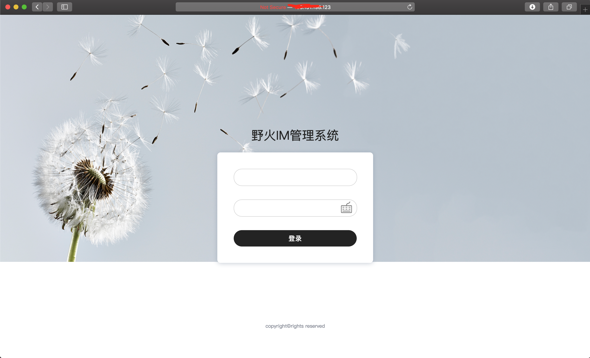
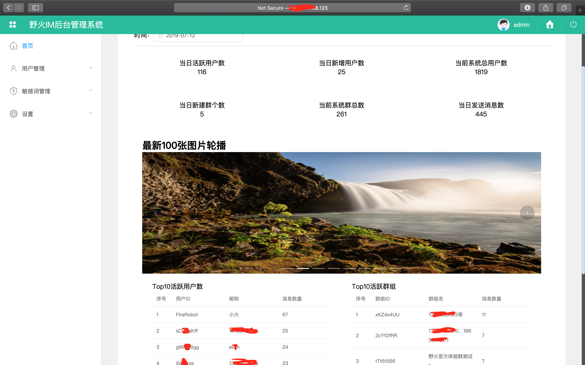
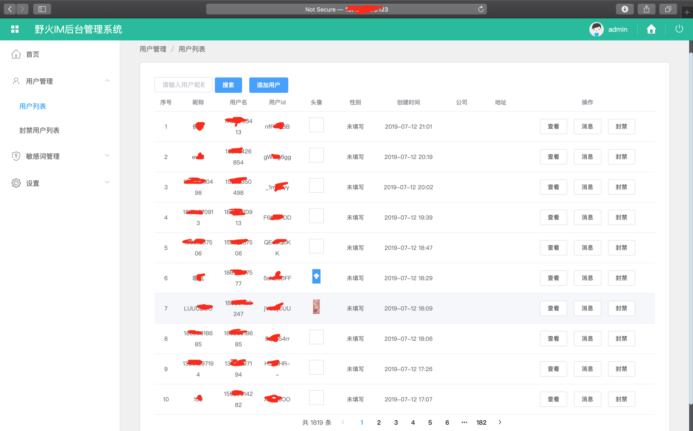
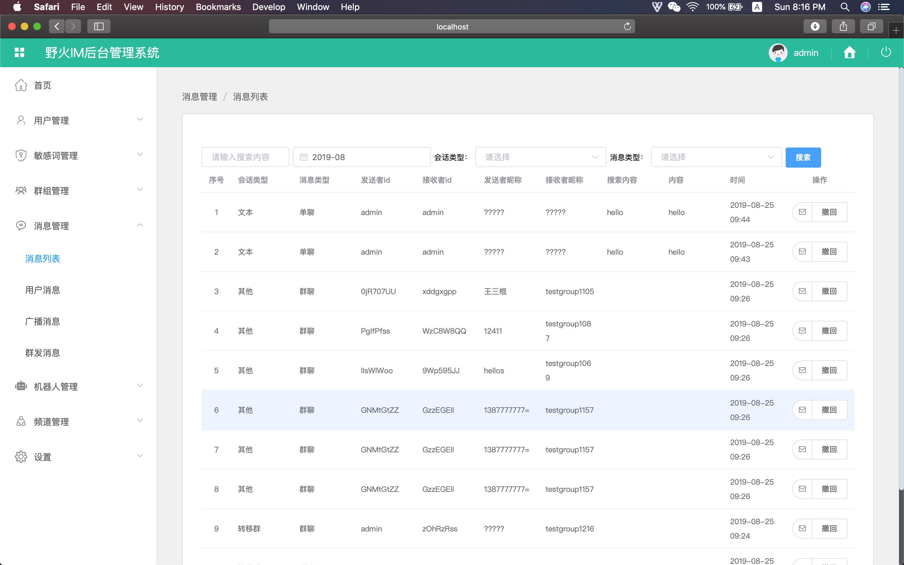

# 野火IM后台管理服务
野火IM管理后台属于IM核心服务之外的支持服务，可以用来查看系统统计，管理用户，设置敏感词，能够极大地提高IM拥有者对系统的掌控，建议联系我们购买。

#### 登录界面

#### 欢迎首页
欢迎首页展示系统的统计信息

#### 用户管理
可以显示用户信息，新建用户，修改用户信息，查看用户的消息，给该用户发送消息，封禁/解封用户。

#### 封禁用户列表

#### 敏感词管理
可以添加/删除敏感词

#### 敏感词消息
可以查看谁命中了敏感词

#### 群组管理
可以新建群组，添加/移除群成员，修改管理员状态，转移群主，解散群组，禁言群组，禁止私聊群组等群组操作

#### 消息管理
消息列表：可以列出所有消息，可以按照会话查看消息，可以撤回消息

用户消息列表：可以列出该用户的所有收发消息

广播消息：只有专业版才能支持，可以发送消息给所有人

多播消息：可以选取100个目标用户，发送文本消息

#### 机器人管理
可以查看，新建，修改和禁用机器人

#### 频道管理
可以查看，新建，修改和禁用频道

#### 修改密码

